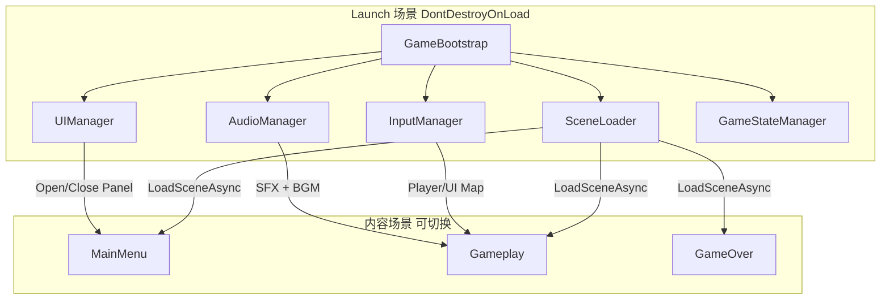
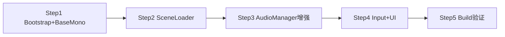
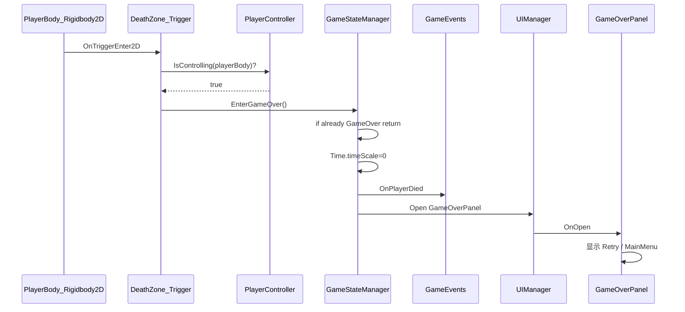

# GameJam 通用框架架构方案

## 现状盘点

| 模块 | 已有 | 缺口 |
|------|------|------|
| 单例基类 | [`BaseMonoManager.cs`](Assets/_Game/Scripts/Core/BaseMonoManager.cs) | 无 `DontDestroyOnLoad`、无重复实例销毁、无初始化顺序 |
| 音频 | [`AudioManager.cs`](Assets/_Game/Scripts/Core/AudioManager.cs) + [`AudioClipSO`](Assets/_Game/Scripts/Data/AudioClipSO.cs) | 仅 SFX `PlayOneShot`；无 BGM 循环；无音量/静音；单 AudioSource |
| 场景 | 仅 `SampleScene` 在 Build 列表 | 无切换 API、无 Bootstrap、无过渡 |
| 输入 | `activeInputHandler: 0`（仅 Legacy） | 未安装 Input System 包；无 `.inputactions` |
| UI | 有 `ugui` + `TMP` 包 | 无 Canvas/EventSystem、无 Panel 基类、无 UIManager |
| Build | 单场景、Mono 后端 | 未验证 exe；Manager 绑在 SampleScene 上，换场景会丢失 |

**核心问题：** 当前 `AudioManager` 直接放在 [`SampleScene.unity`](Assets/_Game/Scenes/SampleScene.unity) 里，一旦切换场景就会被销毁。Jam 框架必须先解决 **常驻生命周期** 问题。

---

## 推荐架构：Bootstrap + Manager 层



### 设计原则（Jam 向）

1. **够用就好**：Manager 用现有单例模式扩展，不引入 Zenject/VContainer 等 DI 框架
2. **一个入口**：`Launch.unity` 作为 Build Index 0，所有系统在此初始化并 `DontDestroyOnLoad`
3. **字符串 + 常量**：场景名、音频名、UI 名用 `static class` 常量，Jam 期间够快
4. **事件解耦**：轻量 `GameEvent` 静态事件，避免 Manager 互相硬引用
5. **先跑通 Build**：每加一个系统就 Build 一次 exe 验证

---

## 目录结构扩展

在现有 [`Docs/AssetsDirectoryGuide.md`](Docs/AssetsDirectoryGuide.md) 基础上，Scripts 新增：

```
_Game/
├── Prefabs/
│   ├── Systems/
│   │   └── GameSystems.prefab      # 所有 Manager 的容器
│   └── UI/
│       ├── UIRoot.prefab           # Canvas + EventSystem
│       └── Panels/
│           ├── MainMenuPanel.prefab
│           └── PausePanel.prefab
├── Scenes/
│   ├── Launch.unity                # Build Index 0（仅含 GameSystems）
│   ├── MainMenu.unity              # Build Index 1
│   ├── Gameplay.unity              # Build Index 2（原 SampleScene 可改名）
│   └── GameOver.unity              # 可选
├── Data/
│   └── Input/
│       └── GameInput.inputactions  # New Input System 配置
└── Scripts/
    ├── Core/
    │   ├── BaseMonoManager.cs      # 增强：DDOL + 防重复
    │   ├── GameBootstrap.cs        # 初始化顺序 + 首场景跳转
    │   ├── SceneLoader.cs          # 场景切换
    │   ├── AudioManager.cs         # 增强：BGM + 音量
    │   ├── InputManager.cs         # 输入抽象层
    │   ├── UIManager.cs            # UI 栈管理
    │   ├── GameStateManager.cs     # 游戏状态机
    │   └── GameEvents.cs             # 全局事件
    ├── UI/
    │   ├── UIBasePanel.cs          # Show/Hide 基类
    │   └── Panels/                 # 具体 Panel
    ├── Data/
    │   ├── AudioClipSO.cs
    │   └── GameConstants.cs        # 场景名/音频名/UI名 常量
    └── Editor/
        └── BuildValidator.cs       # 一键检查 Build 配置
```

---

## 模块详细设计

### 1. BaseMonoManager 增强

当前问题（[`BaseMonoManager.cs:17-20`](Assets/_Game/Scripts/Core/BaseMonoManager.cs)）：

```csharp
// 现在：无 DDOL，换场景即销毁；重复实例不处理
protected virtual void Awake() { instance = this as T; }
```

增强为：

- `Awake` 中检测重复实例 → `Destroy(gameObject)` 并 return
- 首个实例 `DontDestroyOnLoad(gameObject)`
- 可选 `OnDestroy` 清理 static 引用

所有 Manager 继承此基类，挂在同一个 `GameSystems` prefab 下。

---

### 2. GameBootstrap — 启动入口

职责：
- 挂在 `Launch.unity` 的唯一 GameObject 上
- `Awake` 中按顺序初始化：`InputManager` → `AudioManager` → `UIManager` → `SceneLoader`
- `Start` 中自动加载首个内容场景（如 `MainMenu`）

```csharp
// 伪代码
void Start() {
    SceneLoader.Instance.LoadScene(GameConstants.Scenes.MainMenu);
}
```

**Build 列表顺序：**
1. `Launch.unity`（index 0）
2. `MainMenu.unity`
3. `Gameplay.unity`
4. （其他场景按需追加，均需在 Build Settings 注册）

---

### 3. SceneLoader — 场景管理器

API 设计（Jam 够用）：

| 方法 | 用途 |
|------|------|
| `LoadScene(string name)` | 同步切换（小场景/Jam 够用） |
| `LoadSceneAsync(string name, Action onComplete)` | 异步 + 回调 |
| `ReloadCurrent()` | 重开当前关 |

实现要点：
- 封装 `UnityEngine.SceneManagement.SceneManager`
- 切换前发 `GameEvents.OnSceneLoadStart`，完成后发 `OnSceneLoadComplete`
- 可选：简单淡入淡出（一个全屏 UI Image + CanvasGroup，由 UIManager 提供）

**不做：** Additive 多场景加载（Jam 期间除非明确需要，否则增加复杂度）

---

### 4. AudioManager 增强

当前只有 1 个 AudioSource + `PlayOneShot`。增强为 **双通道**：

| 通道 | AudioSource | 用途 |
|------|-------------|------|
| SFX | `sfxSource` | `PlayOneShot` / 音效 |
| BGM | `bgmSource` | `loop = true`，切换 BGM 时 crossfade 或 stop+play |

新增 API：

```csharp
void PlaySFX(string name, float volume = 1f);
void PlayBGM(string name, bool loop = true);
void StopBGM();
void SetMasterVolume(float v);
void SetSFXVolume(float v);
void SetBGMVolume(float v);
void MuteAll(bool mute);
```

音量持久化：用 `PlayerPrefs` 存 `MasterVolume` / `SFXVolume` / `BGMVolume`，`Awake` 时读取。

保留现有 [`AudioAssetLoader`](Assets/_Game/Scripts/Core/AudioManager.cs) + `Resources/Audio/` 加载链路不变。

---

### 5. InputManager — 双系统并存

**Package 安装：** `com.unity.inputsystem`（通过 Package Manager）

**Project Settings：**
- `activeInputHandler` 改为 `2`（Both）
- 这样 Legacy `Input.GetKeyDown` 和新系统 `.inputactions` 都能用

**资产：** `_Game/Data/Input/GameInput.inputactions`

| Action Map | Actions | 用途 |
|------------|---------|------|
| **Player** | Move (Vector2), Jump, Interact, Attack |  gameplay |
| **UI** | Navigate, Submit, Cancel, Point, Click | 菜单/UI |

**InputManager 职责：**
- 生成 C# class（Input System 自带）
- 在 `Awake` 中 Enable Player map
- 提供统一读取接口，屏蔽底层差异：

```csharp
Vector2 GetMoveInput();       // 优先 New Input System，fallback Legacy
bool GetJumpDown();
bool GetPauseDown();          // Escape / Start 键
void SwitchToUIMap();         // 打开菜单时
void SwitchToPlayerMap();     // 关闭菜单时
```

Legacy fallback 示例：`Input.GetAxisRaw("Horizontal")` + `Input.GetKeyDown(KeyCode.Space)`，保证没配 `.inputactions` 也能跑。

---

### 6. UIManager — UI 框架

**Prefab 结构：**

```
UIRoot (Screen Space Overlay Canvas, sort=100)
├── EventSystem
├── BackgroundLayer     (sort 0)
├── NormalLayer       (sort 100) — 主 UI
├── PopupLayer        (sort 200) — 弹窗
└── TopLayer          (sort 300) — Loading/Fade
```

**UIBasePanel 基类：**

```csharp
public abstract class UIBasePanel : MonoBehaviour {
    public virtual void OnOpen(object param = null) { gameObject.SetActive(true); }
    public virtual void OnClose() { gameObject.SetActive(false); }
}
```

**UIManager API：**

| 方法 | 行为 |
|------|------|
| `Open<T>(object param)` | 从 `_Game/Prefabs/UI/Panels/` 实例化或从缓存池取，压栈 |
| `Close<T>()` | 关闭指定 Panel，弹栈 |
| `CloseTop()` | 关闭栈顶 |
| `CloseAll()` | 清空栈 |

实现策略（Jam 推荐）：
- **预注册字典**：`Dictionary<Type, GameObject>` 在 Inspector 或常量中配置 prefab 路径
- 首次 Open 时 `Instantiate`，Close 时 `SetActive(false)` 缓存（不 Destroy）
- 打开 Pause 时调用 `InputManager.SwitchToUIMap()`

---

### 7. GameStateManager（建议补充）

轻量枚举状态机，适配所有游戏类型：

```csharp
enum GameState { None, MainMenu, Playing, Paused, GameOver }
```

| 状态 | 行为 |
|------|------|
| Playing → Paused | `Time.timeScale = 0`，Open PausePanel，SwitchToUIMap |
| Paused → Playing | `Time.timeScale = 1`，Close PausePanel，SwitchToPlayerMap |
| Any → GameOver | 停 BGM / 播失败音效 / Open GameOverPanel |

监听 `InputManager.GetPauseDown()` 在 Playing/Paused 间切换。

---

### 8. GameEvents — 轻量事件总线

```csharp
public static class GameEvents {
    public static event Action<string> OnSceneLoadStart;
    public static event Action<string> OnSceneLoadComplete;
    public static event Action<GameState, GameState> OnGameStateChanged;
    public static event Action OnPlayerDied;
    // Jam 期间按需追加，不超过 10 个
}
```

避免 Manager 间循环依赖：如 GameOver UI 监听 `OnPlayerDied`，而非直接找 Gameplay 脚本。

---

## Build 通过保障（最易出错环节）

### Build 前检查清单

| 检查项 | 说明 |
|--------|------|
| Build Settings 场景顺序 | `Launch` 必须 index 0 |
| 所有用到的场景已 Add | 漏加会导致 `LoadScene` 失败 |
| Manager 不在内容场景 | 只在 `Launch` / `GameSystems.prefab` |
| Input System | Both 模式下 `.inputactions` 需 Generate C# Class |
| Scripting Backend | Jam 建议 **Mono**（编译快）；IL2CPP 留到最终发布 |
| API Compatibility | .NET Standard 2.1（当前 apiCompatibilityLevel: 6，OK） |
| Odin / ASE | 仅 Editor 程序集，不影响 Player Build |
| Resources | 路径不变，`Resources/Audio/` 仍可用 |
| 空场景能跑 | Launch → MainMenu 不依赖 gameplay 对象 |

### 建议新增 Editor 工具

[`BuildValidator.cs`](Assets/_Game/Scripts/Editor/BuildValidator.cs) 菜单项 `Tools/Validate Build`：
- 检查 Build Settings 是否包含 Launch 且排第一
- 检查 `GameSystems.prefab` 是否存在
- 检查 `GameInput.inputactions` 是否已 Generate C# Class
- 输出 Console 报告

### Build 验证流程

1. File → Build Settings → PC Standalone → Build
2. 运行 exe：应自动进入 MainMenu
3. 按键测试：Pause、UI 导航
4. 切换 Gameplay 场景：Manager 不丢失，BGM 正常
5. 关闭 exe 无报错

---

## 为适应「所有可能游戏类型」的补充建议

按优先级分三档：

### P0 — 强烈建议（本次一并搭建）

| 系统 | 原因 |
|------|------|
| **GameStateManager** | 几乎所有游戏都有 Menu/Play/Pause/Over |
| **GameEvents** | 解耦，Jam 期间改需求不牵一发动全身 |
| **GameConstants** | 场景名/音频名集中管理，防 typo |
| **Pause + Time.timeScale** | 动作/解谜/平台都需要 |
| **BuildValidator** | 避免 Jam 最后一天 Build 翻车 |

### P1 — 有时间就做（2-4 小时）

| 系统 | 适用游戏类型 |
|------|-------------|
| **SimpleObjectPool** | 射击、弹幕、粒子密集类 |
| **Timer / Countdown** | 限时关、Jam 倒计时 |
| **SettingsManager** | PlayerPrefs 封装（音量/分辨率/全屏） |
| **SceneFadeTransition** | 提升体验，Load 异步时防黑屏 |
| **DebugOverlay** | F3 显示 FPS、当前 State、场景名 |

### P2 — 看主题再决定（Jam 开始后）

| 系统 | 何时需要 |
|------|----------|
| **DialogueManager** | 叙事/视觉小说类 |
| **InventoryManager** | RPG/收集类 |
| **WaveManager / Spawner** | 塔防/生存类 |
| **TilemapHelper** | 2D 关卡编辑（已有 feature.2d） |
| **CinemachineController** | 已有 Cinemachine 包，相机跟随/切换 |
| **SaveManager** | 需要跨局存档时 |
| **Localization** | 除非双语，否则跳过 |

### 不建议 Jam 前做

- Addressables（Resources 够用）
- 完整 ECS / DOTS
- 网络多人框架
- 复杂 DI 容器
- 自定义 Shader 管线（已有 ASE + URP）

---

## 实施顺序（推荐分 5 步，每步 Build 验证）



1. **Bootstrap 骨架**：增强 BaseMonoManager → 创建 GameSystems prefab → Launch 场景 → Build exe 空跑
2. **SceneLoader**：MainMenu + Gameplay 场景 → 切换测试 → Build
3. **AudioManager 增强**：BGM 通道 + 音量 → Build
4. **Input + UI**：安装 Input System → `.inputactions` → UIRoot + UIManager + PausePanel → Build
5. **GameState + Events + BuildValidator**：状态机 + 事件 + Editor 检查工具 → 最终 Build

---

## 与现有代码的关系

- **保留并增强** [`AudioManager.cs`](Assets/_Game/Scripts/Core/AudioManager.cs) 和 [`AudioClipSO.cs`](Assets/_Game/Scripts/Data/AudioClipSO.cs)，不推翻重写
- **保留** `Resources/Audio/` 加载方式
- **迁移** SampleScene 中的 AudioManager 到 GameSystems prefab，SampleScene 只留 gameplay 内容
- **删除或移走** [`AudioTest.cs`](Assets/_Game/Scripts/Editor/Tests/AudioTest.cs) 到 Editor 测试，避免打进 Build

---

## 风险提醒

| 风险 | 应对 |
|------|------|
| Input System Both 模式配置错误 | 先用 Legacy fallback 保底；Build 前测键位 |
| UI EventSystem 重复 | 只在 UIRoot prefab 放一个，内容场景不放 |
| DDOL 对象重复 | BaseMonoManager 防重复 + Launch 是唯一入口 |
| Odin 序列化问题 | Manager 字段尽量用 public 或 `[SerializeField]`，不依赖 Odin 特性 |
| 场景未加入 Build | GameConstants + BuildValidator 双重保障 |

---

## 功能设计：主控碰撞 → 游戏结束 → 弹窗

> 适配现有 [`PlayerController`](Assets/_Game/Scripts/Gameplay/PlayerController.cs) / [`PlayerBody`](Assets/_Game/Scripts/Gameplay/PlayerBody.cs) 双人荡绳玩法；复用空壳 [`DeathZone.cs`](Assets/_Game/Scripts/Gameplay/DeathZone.cs)。

### 核心思路：三层分离

| 层 | 职责 | 不应做 |
|----|------|--------|
| **Detection（检测）** | 判断「主控 + Tag 碰撞」 | 不直接 Open UI、不改 timeScale |
| **Orchestration（编排）** | 统一入口 `EnterGameOver()`，防重复触发 | 不关心碰撞细节 |
| **Presentation（表现）** | 弹窗、按钮、音效 | 不检测碰撞 |



### 碰撞检测放哪？

**推荐：放在危险物上的 `DeathZone`（Trigger 侧）**

原因：
- 你们已有空 [`DeathZone.cs`](Assets/_Game/Scripts/Gameplay/DeathZone.cs)
- 关卡里可摆多个死亡区域，逻辑一致
- 「主控判定」交给 `PlayerController.IsControlling()`

**不推荐：** 在 `PlayerBody` 里写 `CompareTag` —— 双人切换时「谁是主控」逻辑在 `PlayerController`，放 Player 侧会重复判断。

### Unity 配置

| 对象 | 组件 | 设置 |
|------|------|------|
| 主控 `PlayerBody` | `Rigidbody2D` + `Collider2D` | 已有；Collider 非 Trigger |
| 危险区域 | `DeathZone` + `Collider2D` | **Is Trigger = true**；Tag = `Death`（在 Tag Manager 新建） |
| 物理 | 2D 碰撞矩阵 | Player 与 Death 层可碰撞 |

Tag 用法：`DeathZone` 用 `[SerializeField] string targetTag = "Death"` 可配置，默认 `"Death"`。

### 需新建 / 修改的文件

#### 新建（框架层，优先）

| 文件 | 作用 |
|------|------|
| [`_Game/Scripts/Data/GameConstants.cs`](Assets/_Game/Scripts/Data/GameConstants.cs) | `Tags.Death`、`UIKeys.GameOver`、场景名常量 |
| [`_Game/Scripts/Core/GameEvents.cs`](Assets/_Game/Scripts/Core/GameEvents.cs) | `event Action OnPlayerDied` |
| [`_Game/Scripts/Core/GameStateManager.cs`](Assets/_Game/Scripts/Core/GameStateManager.cs) | 状态枚举 + `EnterGameOver()` 唯一入口 |
| [`_Game/Scripts/Core/UIManager.cs`](Assets/_Game/Scripts/Core/UIManager.cs) | `Open<T>()` / `Close<T>()` |
| [`_Game/Scripts/UI/UIBasePanel.cs`](Assets/_Game/Scripts/UI/UIBasePanel.cs) | Panel 基类 |
| [`_Game/Scripts/UI/Panels/GameOverPanel.cs`](Assets/_Game/Scripts/UI/Panels/GameOverPanel.cs) | 游戏结束弹窗 + 按钮逻辑 |

#### 修改（玩法层）

| 文件 | 改动 |
|------|------|
| [`DeathZone.cs`](Assets/_Game/Scripts/Gameplay/DeathZone.cs) | 实现 `OnTriggerEnter2D`，校验主控后调 `GameStateManager` |
| [`PlayerController.cs`](Assets/_Game/Scripts/Gameplay/PlayerController.cs) | 暴露 `CurrentPlayer` + `IsControlling()`；`Update/FixedUpdate` 开头检查 `GameState != Playing` |

#### Prefab / 场景

| 资产 | 说明 |
|------|------|
| `_Game/Prefabs/UI/Panels/GameOverPanel.prefab` | 弹窗 UI（TMP 标题 + Retry + MainMenu 按钮） |
| 关卡场景 | 放置带 Trigger 的 DeathZone；**不要**单独做 GameOver 场景（弹窗 overlay 更简单） |

### 代码结构示例

**GameConstants.cs**
```csharp
public static class GameConstants {
    public static class Tags {
        public const string Death = "Death";
        public const string Player = "Player"; // 可选，双重校验
    }
    public static class AudioNames {
        public const string GameOver = "GameOver";
    }
}
```

**GameStateManager.cs — 唯一入口，防重复**
```csharp
public enum GameState { None, MainMenu, Playing, Paused, GameOver }

public class GameStateManager : BaseMonoManager<GameStateManager> {
    public GameState CurrentState { get; private set; } = GameState.Playing;

    public void EnterGameOver() {
        if (CurrentState == GameState.GameOver) return; // 防多次触发

        CurrentState = GameState.GameOver;
        Time.timeScale = 0f;
        // InputManager.Instance?.SwitchToUIMap();
        AudioManager.Instance?.PlayOneShot(GameConstants.AudioNames.GameOver);
        GameEvents.RaisePlayerDied();
        UIManager.Instance?.Open<GameOverPanel>();
    }

    public bool IsPlaying => CurrentState == GameState.Playing;
}
```

**DeathZone.cs — 只负责检测**
```csharp
[RequireComponent(typeof(Collider2D))]
public class DeathZone : MonoBehaviour {
    [SerializeField] private string hazardTag = GameConstants.Tags.Death;

    private void OnTriggerEnter2D(Collider2D other) {
        if (!other.CompareTag(GameConstants.Tags.Player)) return;

        var body = other.GetComponent<PlayerBody>();
        if (body == null) return;

        var controller = FindObjectOfType<PlayerController>(); // 或 controller 单例
        if (controller == null || !controller.IsControlling(body)) return;

        GameStateManager.Instance.EnterGameOver();
    }
}
```

**PlayerController.cs — 暴露主控查询 + 输入门禁**
```csharp
public PlayerBody CurrentPlayer => currentPlayer;

public bool IsControlling(PlayerBody body) => currentPlayer == body;

private void Update() {
    if (!GameStateManager.Instance.IsPlaying) return;
    // 原有输入逻辑...
}
```

**GameOverPanel.cs — 只负责 UI**
```csharp
public class GameOverPanel : UIBasePanel {
    public void OnRetryClicked() {
        Time.timeScale = 1f;
        GameStateManager.Instance.SetState(GameState.Playing);
        UIManager.Instance.Close<GameOverPanel>();
        SceneLoader.Instance.ReloadCurrent();
    }

    public void OnMainMenuClicked() {
        Time.timeScale = 1f;
        UIManager.Instance.CloseAll();
        SceneLoader.Instance.LoadScene(GameConstants.Scenes.MainMenu);
    }
}
```

### 实施依赖顺序

1. `GameConstants` + `GameEvents` + `GameStateManager`（最小版）
2. `UIBasePanel` + `UIManager` + `GameOverPanel` prefab
3. 实现 `DeathZone` + 改 `PlayerController`
4. 场景里：Tag `Death`、摆 Trigger、测主控/非主控碰撞

### 边界情况

| 情况 | 处理 |
|------|------|
| 非主控 PlayerBody 碰到 Death | `IsControlling` 返回 false，不结束 |
| 同一帧多次 Trigger | `GameStateManager` 内 `GameOver` 状态防重复 |
| 固定（Fixed）的主控碰到 Death | 仍应 GameOver（固定不代表无敌） |
| `Time.timeScale = 0` 后物理停 | 弹窗按钮用 `Time.unscaledDeltaTime` 或 UI 不受影响 |
| 框架尚未搭建 | 可临时在 `DeathZone` 里 `Instantiate(gameOverPrefab)`，Jam 开始后替换为 UIManager |

### 新增 Todo（追加到实施计划）

- `game-over-detection`：实现 DeathZone + PlayerController.IsControlling
- `game-over-ui`：GameOverPanel prefab + Retry/MainMenu 按钮 wired

---

## 精简实施路线（不搭完整框架，分步确认）

> 用户确认：跳过 Bootstrap / SceneLoader / UIManager / InputSystem 等完整框架，仅实现「死区判定 + 游戏结束弹窗」。每步完成后停顿，等待确认再继续。

**不引入：** UIManager、SceneLoader、GameBootstrap、InputManager、Launch 场景

**改用轻量方案：** `GameStateManager` + `GameOverUI`（场景内挂 Canvas，Inspector 拖引用）

### 分步计划

| 步骤 | 内容 | 产出文件 | 可验证方式 |
|------|------|----------|------------|
| **Step 1** | 状态编排 | `GameConstants.cs`、`GameStateManager.cs` | 临时按键/Inspector 按钮调用 `EnterGameOver()`，Console 日志 + timeScale=0 |
| **Step 2** | 碰撞检测 | 改 `DeathZone.cs`、`PlayerController.cs` | 主控进入 Death Trigger 触发 GameOver；非主控不触发 |
| **Step 3** | 弹窗 UI | `GameOverUI.cs` + 场景 Canvas 配置 | 弹出面板；Retry 重载当前场景 |
| **Step 4** | 场景配置 | Tag `Death`/`Player`、摆 Trigger、绑 UI | 完整流程跑通 |

### Step 1 详细设计（待实现）

**新建 `GameConstants.cs`**
- `Tags.Player`、`Tags.Death`

**新建 `GameStateManager.cs`**（继承现有 `BaseMonoManager`）
- `GameState` 枚举：`Playing`、`GameOver`
- `EnterGameOver()`：`timeScale=0`、防重复、可选播放 GameOver 音效
- `IsPlaying` 属性
- `ResetToPlaying()`：供 Retry 使用（Step 3）
- 暂不调用 UI（Step 3 再接入 `GameOverUI.Show()`）

**场景配置（Step 1 手动）**
- 在 SampleScene 新建空物体 `GameStateManager`，挂 `GameStateManager` 组件
- 可选：挂临时测试脚本，按 `T` 键调用 `EnterGameOver()` 验证

**Step 1 不包含：** DeathZone、PlayerController 改动、UI 面板
