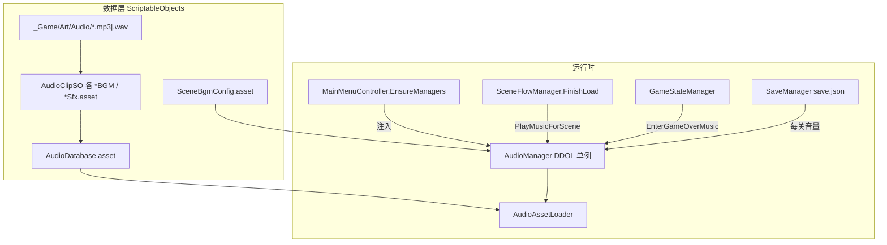
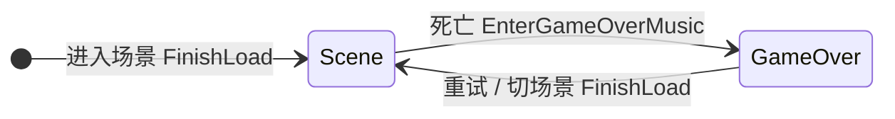

# 音频系统说明

本文档描述 BokeGameJam2026 项目中**音乐（BGM）与音效（SFX）**的完整工作方式：资源组织、运行时架构、场景切换、音量存档，以及如何在代码中调用。

相关文档：

- [资源目录说明](AssetsDirectoryGuide.md) — 音频文件放在哪、如何新建 SO
- [场景流程说明](SceneFlowGuide.md) — 场景切换与 `FinishLoad` 时机
- [主界面说明](MainMenuGuide.md) — `MainMenuController` 如何创建并注入音频配置

---

## 一、设计目标

| 目标 | 实现方式 |
|------|----------|
| 跨场景不中断管理 | 单个 `AudioManager`（`DontDestroyOnLoad` 单例） |
| BGM 与短音效分离 | 两个 `AudioSource`：`bgmSource` / `sfxSource` |
| 资源与代码解耦 | `AudioClipSO` + `AudioDatabase.asset` 总表 |
| 场景自动切 BGM | `SceneBgmConfig.asset` 映射表 + `SceneFlowManager.FinishLoad` |
| 死亡音乐不占 SFX 通道 | `EnterGameOverMusic()` 切换 BGM 上下文 |
| 每关独立音量 | `save.json` 的 `levelBgmVolumes` / `levelSfxVolumes` |
| `timeScale = 0` 仍可播 | `ignoreListenerPause = true` |

---

## 二、架构总览



### 数据流（播放一次音效）

```
业务代码 PlaySfx("CollisionSfx")
  → AudioManager.sfxSource.PlayOneShot(clip, sfxVolume × scale)
    → AudioAssetLoader.GetAudioAsset(name)
      → AudioDatabaseSO.ResolveClip(name)
        → AudioClipSO.GetClip()
          → Unity AudioClip 引用
```

### 数据流（切换场景 BGM）

```
SceneFlowManager 加载完成 FinishLoad()
  → AudioManager.PlayMusicForScene(当前场景名)
    → ApplyVolumesForScene()        // 从存档读该关 BGM/SFX 音量
    → SceneBgmConfig.ResolveEntry() // 场景名 → BGM 逻辑名
    → PlayMusic(bgmName, Scene, loop)
      → bgmSource 播放对应 AudioClip
```

---

## 三、核心组件

### 1. `AudioClipSO`

路径：`Assets/_Game/Scripts/Data/AudioClipSO.cs`  
资产：`Assets/_Game/Data/ScriptableObjects/*BGM.asset`、`*Sfx.asset`

- 菜单：**Create → SO → AuidoClip**
- 字段：`audioClipList`（一个或多个 `AudioClip` 引用）
- `GetClip()`：仅 1 个 clip 时直接返回；多个时**随机**取一个（适用于同类音效变体，不用于关卡 BGM 顺序）

原始音频放在 `_Game/Art/Audio/`，在 SO 的 Inspector 里拖入引用。

### 2. `AudioDatabaseSO`（总表）

路径：`Assets/_Game/Data/ScriptableObjects/AudioDatabase.asset`

将 `GameConstants.AudioNames` 中的**逻辑名**映射到具体 `AudioClipSO`：

| 分类 | 字段 | 逻辑名常量 |
|------|------|-----------|
| BGM | `mainMenuBgm` | `MainMenuBGM` |
| BGM | `level1Bgm` ~ `level4Bgm` | `Level1BGM` ~ `Level4BGM` |
| BGM | `gameOverBgm` | `GameOverBGM` |
| SFX | `buttonClick` | `ButtonClick` |
| SFX | `levelClear` | `LevelClear` |
| SFX | `attachPoint` | `AttachPointSfx` |
| SFX | `countdown` | `CountdownSfx` |
| SFX | `collision` | `CollisionSfx` |
| SFX | `playerHit` | `PlayerHitSfx` |
| SFX | `fall` | `FallSfx` |
| SFX | `waterSplash` | `WaterSplashSfx` |
| SFX | `storyTyping` | `StoryTypingSfx` |

代码中**不要**直接 `Resources.Load` 音频；统一通过逻辑名解析。

### 3. `SceneBgmConfigSO`（场景 → BGM 映射）

路径：`Assets/_Game/Data/ScriptableObjects/SceneBgmConfig.asset`

每行：`sceneName`（与 Build Settings 场景文件名一致）+ `bgmAudioName`（上表逻辑名）+ `loop`。

当前配置：

| 场景 | BGM 逻辑名 |
|------|-----------|
| MainMenu | MainMenuBGM |
| level1 | Level1BGM |
| level2 | Level2BGM |
| level3 | Level3BGM |
| level4 | Level4BGM |

新增场景时：在此资产加一行，并在 `AudioDatabase` 中确保有对应 BGM 字段与 SO。

### 4. `AudioManager`（运行时播放器）

路径：`Assets/_Game/Scripts/Core/AudioManager.cs`

**单例、跨场景常驻**（`PersistAcrossScenes = true`）。  
正常流程从 `MainMenu` 进入时，由 `MainMenuController.EnsureManagers()` 动态创建；**不需要**在每个关卡场景各挂一份。

双通道：

| 通道 | 用途 | 典型内容 |
|------|------|----------|
| `bgmSource` | 循环长音乐，同一时刻只播一首 | 主菜单 / 各关 BGM、GameOverBGM |
| `sfxSource` | `PlayOneShot` 短音效 | 点击、碰撞、通关等 |

#### 音乐上下文（MusicContext）



- **Scene**：由 `PlayMusicForScene` 驱动，按 `SceneBgmConfig` 播场景 BGM
- **GameOver**：死亡时 `EnterGameOverMusic()`，在 BGM 通道播 `GameOverBGM`（非 SFX OneShot）
- 切场景或重试后 `FinishLoad` 会再次 `PlayMusicForScene`，自动恢复关卡 BGM

`PlayMusic` 优化：若上下文、音乐名未变且已在播放，则只更新音量，不重头播放。

### 5. `AudioAssetLoader`

静态类，持有当前 `AudioDatabaseSO` 引用。  
`AudioManager.SetAudioDatabase()` / `Awake` 时注入；对外 `GetAudioAsset(string audioName)`。

---

## 四、启动与注入

从 **MainMenu** 场景 Play 时：

1. `MainMenuController.Awake` → `EnsureManagers()`
2. 创建或找到 `AudioManager`、`SceneFlowManager`、`SaveManager`
3. 注入：
   - `LevelDatabase.asset`
   - `SceneBgmConfig.asset`
   - `AudioDatabase.asset`
4. `AudioManager.PlayMusicForActiveScene()` → 播主菜单 BGM

Inspector 建议在 `MainMenuController` 上拖好上述三个 SO（打包后更稳妥；Editor 下 `AudioManager` 也会尝试自动加载 `AudioDatabase`）。

关卡场景内遗留的 `AudioManager` 节点会被单例去重销毁，可忽略或后续清理。

---

## 五、自动触发点（已接线）

| 时机 | 调用方 | 音频行为 |
|------|--------|----------|
| 主菜单 Awake | `MainMenuController` | `PlayMusicForActiveScene()` → MainMenuBGM |
| 任意场景加载完成 | `SceneFlowManager.FinishLoad` | `PlayMusicForScene` → 按场景切 BGM + 读该关音量 |
| 玩家死亡 | `GameStateManager.EnterGameOver` | `EnterGameOverMusic()` |
| 主菜单 / 弹窗按钮 | `MainMenuView`、各 `*DialogView` 等 | `PlayButtonClick()` |
| 挂 `UIButtonClickSound` 的按钮 | 组件 `onClick` | `PlayButtonClick()` 或自定义名 |
| 吸附锚点 | `PlayerController.AttachPlayerToPoint` | `PlaySfx(AttachPointSfx)` |
| 触碰出口门 | `ExitDoor` | `PlaySfx(LevelClear)` |
| GameOver 点 Retry | `GameOverUI` | 点击音 → `ReloadCurrentLevel` → `FinishLoad` 恢复关卡 BGM |

### 仅 API 就绪、待业务接线

以下方法已在 `AudioManager` 中提供，需在对应玩法逻辑里主动调用：

- `PlayCountdown()` — 倒计时
- `PlayCollision()` — 碰撞
- `PlayPlayerHit()` — 受击
- `PlayFall()` — 掉落
- `PlayWaterSplash()` — 落水
- `PlayStoryTyping()` — 剧情打字

临时测试可用 `Assets/_Game/Scripts/Editor/Tests/AudioTest.cs`（挂到物体上，填 `audioName` 调 `Play()`）。

---

## 六、每关音量与存档

### 存档字段（`SaveData` / `save.json`）

```json
{
  "levelBgmVolumes": [1.0, 0.8, 1.0, 1.0],
  "levelSfxVolumes": [1.0, 1.0, 0.5, 1.0]
}
```

索引与关卡索引一致：`0` = 第 1 关（level1），以此类推。  
主菜单等非关卡场景使用默认音量 `1.0`，不写入上述数组。

### 应用时机

进入关卡场景时，`PlayMusicForScene` → `ApplyVolumesForScene`：

- 用 `LevelDatabase.GetIndexByScene(sceneName)` 得到关卡索引
- 从 `SaveManager` 读取 `GetLevelBgmVolume` / `GetLevelSfxVolume`
- 应用到 `musicVolume` / `sfxVolume`（影响后续 BGM 与所有 SFX）

### 调节 API

| API | 说明 |
|-----|------|
| `SetMusicVolume(v)` | 改当前关 BGM 音量并写存档 |
| `SetSfxVolume(v)` | 改当前关 SFX 音量并写存档 |
| `SetLevelMusicVolume(levelIndex, v)` | 改指定关 BGM（正在该关时立即生效） |
| `SetLevelSfxVolume(levelIndex, v)` | 改指定关 SFX |

游戏内设置 UI（`SettingsDialogView`）音量滑条尚未接线，可直接调用以上 API。

---

## 七、代码调用示例

### 播放音效（推荐语义化 API）

```csharp
AudioManager.Instance?.PlayCollision();
AudioManager.Instance?.PlayWaterSplash(0.8f);  // 额外音量倍率
```

### 通用按名播放

```csharp
AudioManager.Instance?.PlaySfx(GameConstants.AudioNames.StoryTyping);
```

### UI 按钮

- 方式 A：在 View 的 `onClick` 里 `AudioManager.Instance?.PlayButtonClick()`
- 方式 B：给 Button 挂 `UIButtonClickSound` 组件（可覆盖 `audioName`）

### 手动切 BGM（少见）

```csharp
AudioManager.Instance?.PlayMusicForScene("level2");
AudioManager.Instance?.PlayMusicForActiveScene();
```

---

## 八、新增 / 替换音频工作流

### 替换已有音效

1. 将新文件放入 `_Game/Art/Audio/`
2. 打开对应 `*Sfx.asset` 或 `*BGM.asset`
3. 修改 `audioClipList` 中的引用

### 新增一种音效

1. `_Game/Art/Audio/` 放入 clip
2. `ScriptableObjects/` 下 **Create → SO → AuidoClip**，命名与用途一致
3. `GameConstants.AudioNames` 增加常量
4. `AudioDatabaseSO` 增加字段与 `ResolveClipSO` 分支
5. `AudioDatabase.asset` 绑定新 SO
6. （可选）`AudioManager` 增加 `PlayXxx()` 便捷方法
7. 在玩法代码中调用

### 新增关卡 BGM

1. 新建 `LevelXBgm.asset` 并绑定 clip
2. `AudioDatabase` 增加 `levelXBgm` 字段（或扩展 SO 结构）
3. `GameConstants.AudioNames` 增加 `LevelXBGM`
4. `SceneBgmConfig` 增加 `sceneName` → `LevelXBGM` 一行

---

## 九、测试清单

从 **MainMenu** Play：

1. 主菜单 → MainMenuBGM + 按钮点击音
2. 进 level1 → 切到 Level1BGM（`第一关.mp3`）
3. 通关进 level2 → 切到 Level2BGM（不应继续播第一关音乐）
4. 死亡 → GameOverBGM，关卡 BGM 停止
5. Retry → 恢复当前关 BGM
6. 锚定 / 出口门 → AttachPointSfx / LevelClear
7. 调节音量后重进该关 → 音量从 `save.json` 恢复

无声时查看 Console：`[AudioManager] 未找到音乐/音效：xxx` → 检查 `AudioDatabase` 与 SO 的 `audioClipList`。

---

## 十、关键文件索引

| 文件 | 职责 |
|------|------|
| `Scripts/Core/AudioManager.cs` | 播放、音量、双通道、上下文 |
| `Scripts/Data/AudioDatabaseSO.cs` | 逻辑名 → AudioClipSO |
| `Scripts/Data/AudioClipSO.cs` | clip 列表与 GetClip |
| `Scripts/Data/SceneBgmConfigSO.cs` | 场景名 → BGM 逻辑名 |
| `Scripts/Data/GameConstants.cs` | `AudioNames` 常量 |
| `Scripts/Core/SceneFlowManager.cs` | `FinishLoad` 触发 BGM |
| `Scripts/Core/GameStateManager.cs` | 死亡触发 GameOver BGM |
| `Scripts/Core/SaveManager.cs` | 每关音量读写 |
| `Scripts/UI/MainMenuController.cs` | 创建 AudioManager 并注入配置 |
| `Scripts/UI/UIButtonClickSound.cs` | 可复用按钮点击组件 |
| `Data/ScriptableObjects/AudioDatabase.asset` | 音频总表 |
| `Data/ScriptableObjects/SceneBgmConfig.asset` | 场景 BGM 映射 |

---

## 十一、已知限制与后续

- 主菜单 BGM / 音量：主菜单不走 `levelBgmVolumes`，音量固定默认 `1.0`（除非扩展存档字段）
- 无 BGM 淡入淡出：切歌为 stop + play
- 无全局 Master 音量滑条：Phase 5 设置 UI 待接
- `AudioClipSO` 多 clip 为随机，非顺序播放；关卡 BGM 应每关独立 SO（当前方案）
