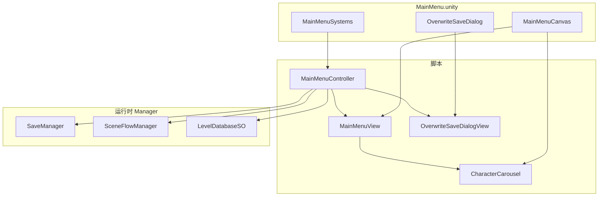

# 主界面说明文档（Phase 3）

本文档描述游戏主界面（`MainMenu.unity`）的架构、脚本职责、按钮行为、场景搭建与测试方式。场景流与转场相关内容见 [SceneFlowGuide.md](SceneFlowGuide.md)。

---

## 一、概述与已确认规则

| 项 | 决定 |
|----|------|
| 存档 | 本地 `save.json`，仅关卡进度（`hasSave` / `currentLevelIndex` / `completedLevelIndices`） |
| 进入关卡 | 一律使用场景**初始位置**，不恢复点位 |
| 继续按钮 | **始终显示**；无存档时灰色不可点（`CanContinue` = `hasSave`） |
| 关卡数 | 4 关，场景名 `level1`–`level4` |
| 解锁 | 线性：第 1 关默认解锁，通关第 N 关解锁第 N+1 关 |
| UI 组织 | uGUI + **Controller + View**；代码不生成界面，美术在 Editor 摆 Canvas 并拖引用 |
| 星级 | 后移为扩展 Phase；当前仅占位 API，成就页暂不显示真实星级 |
| 接口层 | **无** `IMenuPanel` / `IOverwriteSaveDialog`；直接使用具体 View 类 |

### Phase 3 完成状态

- **代码**：已完成（Controller、View、覆盖弹窗、角色轮播）
- **场景骨架**：`MainMenu.unity` 已有系统节点与 Canvas 占位
- **待美术/Editor**：5 个菜单 Button、弹窗 UI 与 Inspector 引用尚未配齐（见 [第九节](#九待美术editor-完成项)）

---

## 二、架构



**分工原则：**

- `MainMenuController`：存档逻辑、场景跳转、弹窗事件订阅，不持有具体 UI 节点
- `MainMenuView`：持有 Button 引用，运行时 `Bind(controller)` 注册点击
- `OverwriteSaveDialogView`：覆盖存档确认 UI，由 Controller 调用 `ShowForNewGame` / `ShowForLevelSelect`
- `CharacterCarousel`：展示区角色图轮播，数据来自 `LevelDatabase` 或手动 Sprite 列表

---

## 三、脚本职责

| 文件 | 职责 |
|------|------|
| [`MainMenuController.cs`](../Assets/_Game/Scripts/UI/MainMenuController.cs) | 菜单按钮回调、继续按钮刷新、`RequestEnterLevel`、Manager 初始化、弹窗确认后跳转 |
| [`MainMenuView.cs`](../Assets/_Game/Scripts/UI/MainMenuView.cs) | 5 个 Button 绑定、`SetContinueEnabled`、轮播初始化、引用校验 |
| [`OverwriteSaveDialogView.cs`](../Assets/_Game/Scripts/UI/OverwriteSaveDialogView.cs) | 覆盖存档弹窗显隐、动态/固定文案、确认/取消 |
| [`CharacterCarousel.cs`](../Assets/_Game/Scripts/UI/CharacterCarousel.cs) | 每 2 秒轮播角色图；`manualSprites` 优先，否则读 `LevelDatabase.characterSprite` |

**依赖的核心系统（Phase 1–2 已完成）：**

| 文件 | 用途 |
|------|------|
| [`SaveManager.cs`](../Assets/_Game/Scripts/Core/SaveManager.cs) | 存档读写、`CanContinue`、`IsLevelUnlocked`、星级占位 API |
| [`SceneFlowManager.cs`](../Assets/_Game/Scripts/Core/SceneFlowManager.cs) | 场景加载与转场 |
| [`LevelDatabase.asset`](../Assets/_Game/Data/ScriptableObjects/LevelDatabase.asset) | 4 关配置、`displayName`、角色/背景图 |

---

## 四、五个菜单按钮行为

| 按钮 | 方法 | 行为 |
|------|------|------|
| 继续游戏 | `OnContinueClicked` | `CanContinue` 为 false 时不响应；否则 `TryGetContinueLevel` → 加载当前进度关卡（场景初始位置） |
| 新游戏 | `OnNewGameClicked` | 有存档 → 弹覆盖确认；无存档 → `BeginNewGame()` + 加载第 1 关 |
| 关卡成就 | `OnLevelAchievementClicked` | 打开 `LevelAchievementView` |
| 致谢名单 | `OnCreditsClicked` | 打开 `CreditsView` |
| 退出游戏 | `OnExitGameClicked` | 打开 `ExitGameDialogView` 确认；未配置弹窗时直接退出 |

**继续按钮灰态：**

- `MainMenuView.SetContinueEnabled(bool)` 设置 `continueButton.interactable`
- 可选：拖入 `continueDisabledOverlay`（Graphic），禁用时显示遮罩

---

## 五、覆盖存档弹窗

[`OverwriteSaveDialogView`](../Assets/_Game/Scripts/UI/OverwriteSaveDialogView.cs) 在 **有存档**（`hasSave`）时弹出，确认后进入对应关卡的**场景初始位置**。

### 调用方式

| 场景 | 方法 | 动态文案 |
|------|------|----------|
| 点击「新游戏」 | `ShowForNewGame()` | 「开启新游戏，」 |
| 关卡成就选关（Phase 4） | `ShowForLevelSelect(levelIndex)` | 「如进入指定关卡，」 |

固定文案默认：「会覆盖当前存档，是否确认？」（可在 Inspector 修改 `fixedLineDefault`）。

### 事件（Controller 已订阅）

| 事件 | 触发时机 | Controller 处理 |
|------|----------|-----------------|
| `OnNewGameConfirmed` | 确认新游戏 | `BeginNewGame()` + 加载第 1 关 |
| `OnLevelSelectConfirmed` | 确认选关 | `SetCurrentLevel(index)` + 加载该关 |
| `OnCanceled` | 点击取消 | 无操作 |

### Phase 4 选关入口

关卡成就页应调用：

```csharp
mainMenuController.RequestEnterLevel(levelIndex);
```

- 有存档且已配置弹窗 → 自动 `ShowForLevelSelect`
- 否则直接 `SetCurrentLevel` + 加载关卡

---

## 六、角色轮播

[`CharacterCarousel`](../Assets/_Game/Scripts/UI/CharacterCarousel.cs) 挂在展示区节点上。

| Inspector 字段 | 说明 |
|----------------|------|
| `displayImage` | 显示角色图的 Image |
| `manualSprites` | 手动 Sprite 列表（**优先**于 LevelDatabase） |
| `levelDatabase` | 可选；从各关 `characterSprite` 收集 |
| `intervalSeconds` | 轮播间隔，默认 2 秒 |
| `playOnEnable` | 启用时自动开始 |

无可用 Sprite 时显示灰色占位色。`MainMenuView.InitializeCarousel(levelDatabase)` 在 `Awake` 时由 Controller 调用。

---

## 七、场景搭建步骤（美术 / 策划）

### 推荐层级

```
MainMenu.unity
├── Main Camera
├── EventSystem
├── MainMenuSystems          ← MainMenuController + LevelDatabase 引用
└── MainMenuCanvas           ← Canvas + MainMenuView
    ├── Background           (Image)
    ├── TitleArea            (Text × 2，可选)
    ├── MenuArea             (Button × 5)
    ├── ShowcaseArea         (Image + CharacterCarousel)
    └── Panels/
        └── OverwriteSaveDialog   ← OverwriteSaveDialogView
            ├── Mask / PanelRoot
            ├── DynamicLineText
            ├── FixedLineText
            ├── ConfirmButton
            └── CancelButton
```

### 搭建顺序

1. 打开 `Assets/_Game/Scenes/MainMenu.unity`
2. 确认 `MainMenuSystems` 上已挂 `MainMenuController`，并拖入 `LevelDatabase`
3. 在 `MainMenuCanvas` 下摆背景、标题、5 个 Button、展示区
4. 在展示区子节点挂 `CharacterCarousel`，拖入 `displayImage`（及可选 `manualSprites`）
5. 在 `Panels/OverwriteSaveDialog` 搭弹窗 UI，挂 `OverwriteSaveDialogView`，拖齐引用
6. 在 `MainMenuController` 上拖入 `MainMenuView`、`OverwriteSaveDialogView`
7. 在 `MainMenuView` 上拖入 5 个 Button、可选遮罩、`CharacterCarousel`
8. 右键各 View 组件 → **Validate References**，确认 Console 无报错

### Inspector 拖引用清单

| 组件 | 需要拖入 |
|------|----------|
| `MainMenuController` | `MainMenuView`、`OverwriteSaveDialogView`、`LevelDatabase` |
| `MainMenuView` | 5 个菜单 Button、可选 `continueDisabledOverlay`、`CharacterCarousel` |
| `OverwriteSaveDialogView` | `panelRoot`、动态/固定文案 Text、确认/取消 Button |
| `CharacterCarousel` | `displayImage`、可选 `manualSprites` 或 `LevelDatabase` |

### 按钮接线

由 `MainMenuView.Bind()` 在运行时自动注册，**无需**在 Button 的 OnClick 里手动绑 `MainMenuController` 方法。

---

## 八、测试步骤

### 1. 引用校验

Play 前在 Editor 中对 `MainMenuView`、`OverwriteSaveDialogView` 执行 **Validate References**。

### 2. 主界面流程（Play MainMenu 场景）

| 步骤 | 操作 | 预期 |
|------|------|------|
| 无存档 | 进入主界面 | 「继续游戏」灰色不可点 |
| 新游戏 | 点击「新游戏」 | 直接进入 `level1`（场景初始位置） |
| 模拟有档 | 用 `SaveManagerTest` 按 `1` 新游戏或 `3` 模拟通关 | 存档写入 `save.json` |
| 继续 | 回到主界面，点「继续游戏」 | 进入存档中的当前关 |
| 覆盖确认 | 有档时点「新游戏」 | 弹出覆盖弹窗；确认后进第 1 关；取消无变化 |

### 3. 存档与解锁（SaveManagerTest）

将 [`SaveManagerTest`](../Assets/_Game/Scripts/Core/SaveManagerTest.cs) 挂到测试场景或 MainMenu，Play 后：

| 按键 | 功能 |
|------|------|
| `1` | 新游戏并重载第 1 关 |
| `2` | 继续游戏 |
| `3` | 模拟当前关卡通关 |
| `4` | 清空存档 |
| `5` | 打印存档路径与内容 |
| `6` | 打印四关解锁状态 |

### 4. 场景流（SceneFlowTest）

[`SceneFlowTest`](../Assets/_Game/Scripts/Core/SceneFlowTest.cs)：`O` 下一关、`P` 重载、`M` 回主菜单。在主菜单按 `O` 应进入 `level1`（已修复此前跳回主菜单的问题）。

### 5. Build 验证

Build Settings 已注册：`MainMenu`（Index 0）+ `level1`–`level4`。打包后应从主界面启动并可新游戏/继续。

---

## 九、待美术/Editor 完成项

当前 [`MainMenu.unity`](../Assets/_Game/Scenes/MainMenu.unity) 中以下引用**尚未配齐**：

| 项 | 状态 |
|----|------|
| `MainMenuView` 的 5 个 Button | 均为空（`{fileID: 0}`） |
| `MainMenuView` 的 `CharacterCarousel` | 为空 |
| `OverwriteSaveDialog` 脚本 | 需重新挂载 `OverwriteSaveDialogView`（场景中 `m_Script` 曾丢失） |
| 弹窗 `dynamicLineText`、`confirmButton`、`cancelButton` | 未拖入 |
| 菜单区 / 标题区 / 背景 UI | 需美术自行布局 |

完成上述接线后，Phase 3 即可验收。

---

## 十、Phase 4 弹窗与面板（代码已完成）

Phase 4 延续 Controller + View 模式，**不生成 UI**。美术在 Canvas 下搭建面板并拖引用即可。

### 场景结构建议

```
MainMenuCanvas
└── Panels/
    ├── OverwriteSaveDialog      ← Phase 3
    ├── ExitGameDialog         ← ExitGameDialogView
    ├── LevelAchievementPanel    ← LevelAchievementView
    │   ├── LevelItem_0          ← LevelAchievementItemView
    │   ├── LevelItem_1
    │   ├── LevelItem_2
    │   └── LevelItem_3
    └── CreditsPanel             ← CreditsView
```

### 脚本职责

| 文件 | 功能 |
|------|------|
| `ExitGameDialogView` | 退出确认文案 + 确认/取消；确认后退出应用 |
| `LevelAchievementView` | 刷新 4 关解锁状态，选关通知 Controller |
| `LevelAchievementItemView` | 单行：标题、锁态遮罩、进入按钮；`starsRoot` 默认隐藏 |
| `CreditsView` | 致谢文案 + 可选 ScrollRect 自动滚动 + 关闭 |

### MainMenuController 接线

| 菜单按钮 | 打开面板 |
|----------|----------|
| 退出游戏 | `exitGameDialogView.Show()` |
| 关卡成就 | `levelAchievementView.Show(levelDatabase, SaveManager)` |
| 致谢名单 | `creditsView.Show()` |

选关流程：`LevelAchievementItemView` → `LevelAchievementView.OnLevelEnterRequested` → `MainMenuController.RequestEnterLevel` → 有档时 `OverwriteSaveDialogView`。

打开任一面板前会调用 `CloseAllPanels()`，避免多面板叠显。

### Inspector 拖引用清单

| 组件 | 需要拖入 |
|------|----------|
| `MainMenuController` | 上述 3 个面板 View + `ExitGameDialogView`（可不拖，运行时 `FindObjectOfType` 兜底） |
| `ExitGameDialogView` | `panelRoot`、可选 `messageText`、确认/取消 Button |
| `LevelAchievementView` | `panelRoot`、`closeButton`、4 个 `LevelAchievementItemView` |
| `LevelAchievementItemView` | `titleText`、`lockedOverlay`、`enterButton`；可选 `starsRoot` |
| `CreditsView` | `panelRoot`、`creditsText`、可选 `scrollRect`、`closeButton` |

各 View 均支持 **右键 → Validate References** 校验。

### Phase 4 测试

| 步骤 | 操作 | 预期 |
|------|------|------|
| 退出 | 点「退出游戏」 | 打开确认弹窗；确认后退出（Editor 下停止 Play） |
| 致谢 | 点「致谢名单」 | 打开致谢；ScrollRect 配置后自动上滚 |
| 成就-锁 | 无存档通关记录 | 仅第 1 关可进，其余显示锁态 |
| 成就-解锁 | `SaveManagerTest` 按 `3` 模拟通关 | 下一关解锁、可点击进入 |
| 成就-覆盖 | 有存档时选关 | 弹出覆盖确认；确认后进入对应关 |

### 扩展 Phase / Phase 5 预留

- `LevelAchievementView.showStars`：设为 `true` 并配置星图后显示三星
- `LevelAchievementView.resetProgressButton`：当前强制隐藏/禁用，扩展 Phase 启用
- `SettingsDialogView`：仅用于 Phase 5 游戏内设置（回到主页面、手动存档等）

---

## 十一、相关文件索引

```
Assets/_Game/
├── Scenes/MainMenu.unity
├── Data/ScriptableObjects/LevelDatabase.asset
└── Scripts/
    ├── Core/
    │   ├── SaveManager.cs
    │   ├── SceneFlowManager.cs
    │   ├── SaveManagerTest.cs
    │   └── SceneFlowTest.cs
    └── UI/
        ├── MainMenuController.cs
        ├── MainMenuView.cs
        ├── OverwriteSaveDialogView.cs
        ├── ExitGameDialogView.cs
        ├── SettingsDialogView.cs
        ├── LevelAchievementView.cs
        ├── LevelAchievementItemView.cs
        ├── CreditsView.cs
        └── CharacterCarousel.cs
```

**已删除（勿再引用）：**

- `MainMenuUI.cs`（运行时生成 UI，已废弃）
- `IMenuPanel.cs`、`IOverwriteSaveDialog.cs`（接口层已移除）
- 点位存档相关（`CheckpointSpawnManager`、`AttachPointRegistry` 等）
